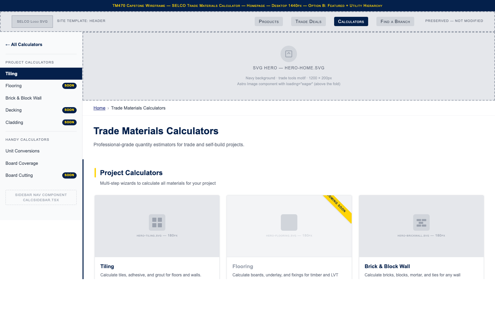
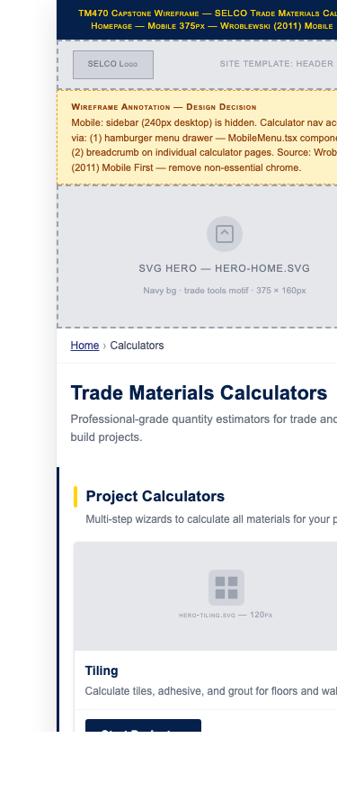
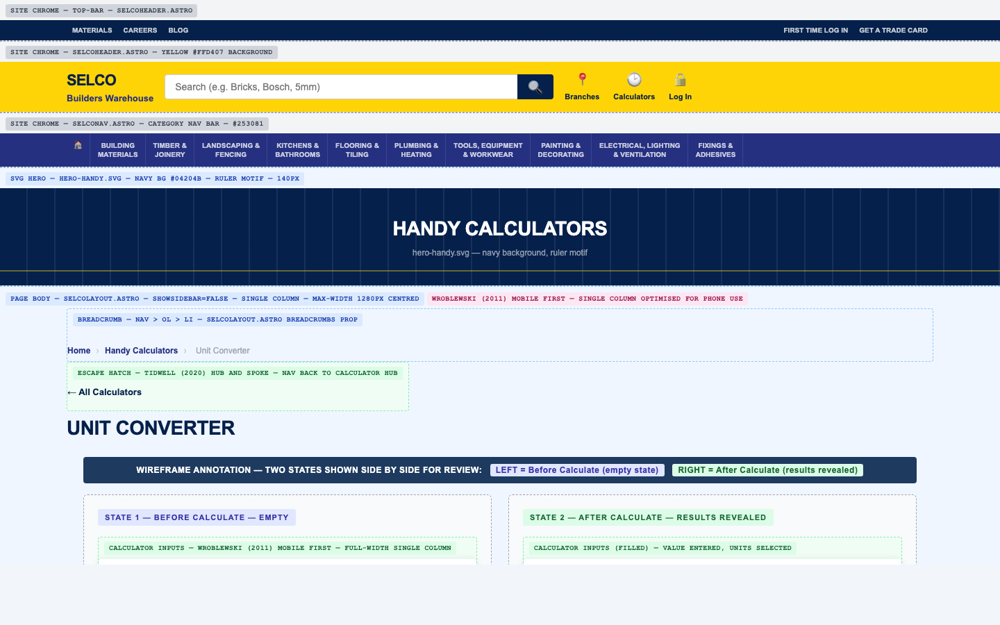
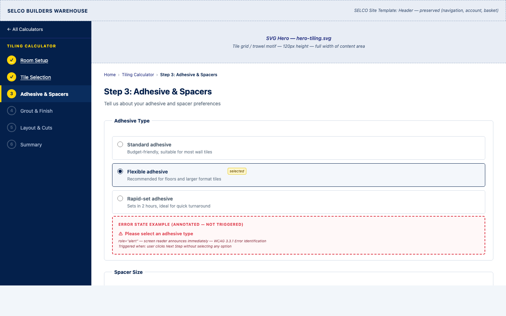
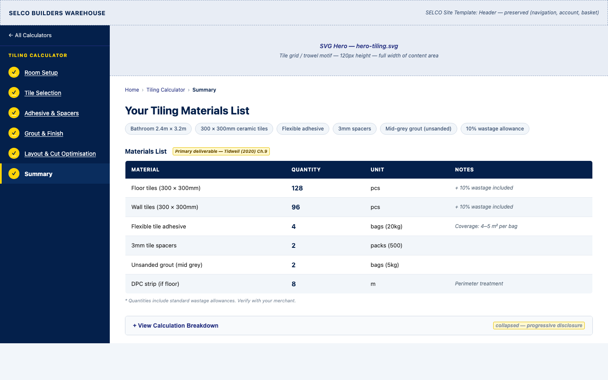
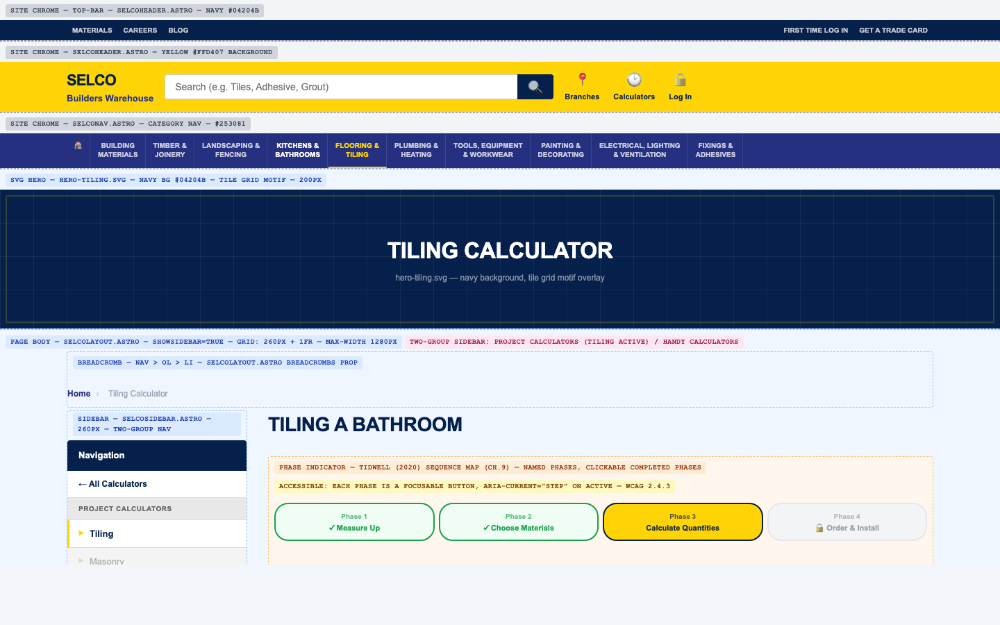

# TMA 02 — Design Template Refresh: Wireframes & Layout Report

**Module:** TM470 Computing and IT Project
**Student:** Sami Bashraheel (Y4347284)
**Iteration:** 2 — Core Build and Redesign
**Date:** 19 March 2026
**Repository:** github.com/sami/selco

---

## 1. Executive Summary

This report documents the design decisions, wireframe deliverables, and implementation roadmap
for Iteration 2 of the Selco Trade Calculator — a web-based materials estimation tool targeted
at trade professionals and serious DIY users of SELCO Builders Warehouse.

The Iteration 1 prototype (TMA 01) established a correct three-layer architecture (pure logic →
project configurations → Astro page routes) and validated the multi-material wizard concept with
internal stakeholders. However, it suffers from critical visual failures: twelve undefined CSS
custom properties render interactive elements as transparent, making the primary call-to-action
buttons, focus rings, and result panels invisible. These P0 fixes are tracked in
`docs/audit/redesign-decisions.html` (decisions A-1 and T-2) and are addressed in a separate
code-fix iteration, not in this document.

This document covers the **design and wireframe layer only**, scoped entirely within
`SelcoLayout.astro`'s content slot. The SELCO site chrome (header, navigation strip, info bar,
footer) is preserved unchanged.

### Scope of this Iteration

Five design areas were defined and resolved:

| # | Area | Decision |
|---|------|----------|
| 2.1 | Homepage — two-category calculator index | Option B: Featured + Utility Hierarchy |
| 2.2 | Standalone calculator page | Option B: Input-first, single column, results reveal |
| 2.3 | Wizard step indicator | Option B: Vertical step rail (desktop) + dot rail (mobile) |
| 2.4 | Navigation structure | Option A: Two-group sidebar + escape hatch |
| 2.5 | Component design system | Option A: Three-role buttons, SELCO palette, 4 px radius |

Six HTML wireframes and seven SVG hero images were created and committed to the repository.
Screenshots of all wireframes are embedded in Section 4.

---

## 2. Design Audit Findings

### 2.1 Critical Issues

The following issues were identified in the Phase 1 audit
(full detail in `docs/audit/audit-report.html` and `docs/audit/ux-evaluation.html`):

| # | ID | Severity | Issue |
|---|----|----------|-------|
| 1 | A-1, T-2 | P0 | 12 phantom CSS custom properties → invisible buttons, borders, and focus rings in `CalculatorLayout.tsx` and wizard components |
| 2 | V-1, V-2 | P0 | Three competing token systems: `SelcoLayout :root`, `global.css @theme`, inline hex values; 7+ inconsistent button patterns |
| 3 | U-1 | P1 | Wizard progress bar is a non-interactive strip — fails Tidwell's (2020) Sequence Map pattern; steps cannot be named or navigated by clicking |
| 4 | U-2 | P1 | No step-level validation on wizard before advancing; submitting empty inputs produces a result of 0 with no error message |
| 5 | V-4 | P1 | Yellow `#FFCD00` on blue `#004B8D` = 2.5:1 contrast ratio — fails WCAG 2.1 SC 1.4.3 (AA minimum 4.5:1 for normal text) |
| 6 | U-4 | P1 | Mobile menu has no focus trap, no Escape handler, no `aria-modal` — fails WCAG 2.1 SC 2.1.2 |
| 7 | A-5 | P2 | Coverage Calculator absent from sidebar navigation; only reachable via homepage grid |
| 8 | A-6 | P2 | Breadcrumbs use non-semantic `
` instead of `<nav aria-label="Breadcrumb"><ol>` |
| 9 | V-5 | P2 | Focus ring invisible on all `CalculatorLayout` inputs — uses phantom token `--color-brand-blue` |
| 10 | U-6 | P2 | No skip navigation link — keyboard users must Tab through full SELCO chrome on every page load |
| 11 | V-3 | P1 | Open Sans declared in body font stack but never imported; all pages fall back to Helvetica |
| 12 | A-2 | P1 | `BaseLayout.astro` is unused (legacy); creates a divergent styling context |

### 2.2 Design System State at Audit

| Area | Current State |
|------|---------------|
| **Token system** | Fragmented — three competing systems; must use `global.css @theme` as single source of truth |
| **Buttons** | No canonical variants; `btn-primary` / `btn-secondary` exist in `global.css` but phantom tokens make them invisible |
| **Typography** | Open Sans referenced in redesign decisions (V-3) but never imported; Arial Black used for page titles |
| **Spacing** | No consistent scale; four different padding/gap values in simultaneous use |
| **Border radius** | Five different values: 6 px, 8 px, 11 px, 12 px, 16 px |
| **Shadows** | Three shadow styles with no naming convention |
| **Breakpoints** | `SelcoLayout` uses hardcoded `1024 px` / `768 px`; Tailwind uses `sm/md/lg/xl` (mismatch) |

### 2.3 Existing Patterns to Preserve

The following patterns are architecturally correct and are carried forward unchanged:

- **Hub & Spoke navigation** — home → calculator pages (Tidwell, 2020, Ch. 3)
- **Grid of Equals** card layout on homepage — correct pattern for a calculator index (Tidwell, 2020, Ch. 4)
- **CalculatorLayout** two-column form + results layout — correct, needs only token fixes
- **Fieldset / legend grouping** in forms — correct WCAG 1.3.1 pattern
- **`page-section` utility class** — correct spacing wrapper

---

## 3. Design Decisions

All five design areas were resolved before wireframe creation. Each decision is grounded in at
least one academic source.

### 3.1 Homepage — Two-Category Calculator Index

**Decision: Option B — Featured + Utility Hierarchy**

The homepage presents the two calculator categories with distinct visual weight: Project
Calculators (the trade-focused, wizard-based tools) appear in a prominent upper grid;
Handy Calculators (utility tools) appear in a smaller, lighter-background strip below.
Upcoming calculators (Flooring, Decking, Cladding, Board Cutting Optimiser) carry diagonal
"Coming Soon" ribbons so that the full product scope is communicated without the items
appearing broken.

Each Project Calculator card contains the relevant SVG hero icon from `public/images/hero/` as
a visual differentiator. The page opens with an SVG banner (`hero-home.svg`) carrying a trade
tagline and the SELCO navy/yellow palette.

**Rationale:**
Tidwell (2020, Ch. 4) *Grid of Equals* establishes that a grid of equally-weighted cards
creates a discoverable index. The additional hierarchy between project and handy tools follows
Tidwell's (2020, Ch. 4) *Visual Framework* — visual weight difference communicates relative
importance without adding navigation complexity. Krug (2014, Ch. 3) argues that users should be
able to scan a page and understand its structure within seconds; the two-section layout with
clear headings satisfies this.

### 3.2 Standalone Calculator Page

**Decision: Option B — Input-first, single column, results reveal**

Standalone calculators (Unit Converter, Board Coverage) use a single-column layout with a
maximum width of 640 px centred on the page. The results panel is hidden until the user
submits the form, at which point it appears below the inputs with a yellow-border highlight.
No sidebar is shown (`showSidebar={false}`). An escape hatch link (`← All Calculators`) sits
immediately below the breadcrumb.

**Rationale:**
Wroblewski (2011) argues that a mobile-first single-column form reduces cognitive load and is
appropriate when the primary use context is a phone held in one hand on a building site. Krug
(2014, Ch. 3) supports this: simplify pages to their minimum viable content. The results-reveal
pattern prevents the page from appearing broken before calculation while keeping the result
prominent after submission. WCAG 2.1 SC 2.4.3 (Focus Order) is satisfied because a linear
single-column layout produces a natural Tab sequence.

### 3.3 Wizard Step Indicator

**Decision: Option B — Vertical step rail (desktop), dot rail (mobile)**

On desktop, the wizard displays a 260 px navy sidebar showing all six steps in a vertical
rail. Each step has one of three states:

- **Completed** — yellow tick circle, clickable link with underline, `aria-current="step"`
- **Active** — yellow filled circle with step number, bold white text, 4 px yellow left bar,
  slightly lighter (`#0a2d5e`) background
- **Upcoming** — grey open circle, grey non-interactive text

On mobile (≤ 640 px), the rail collapses to a horizontal dot row (filled = completed/active,
open = upcoming) with a step label and a `role="progressbar"` ARIA progress bar beneath.

**Rationale:**
Tidwell (2020, p. 321) *Sequence Map*: "Show users where they are in a multi-step process and
let them navigate back to completed steps." The named, clickable step rail directly implements
this pattern. Nielsen (1994, Heuristic 1) *Visibility of System Status*: users must always know
where they are. The three visual states (completed, active, upcoming) provide this at a glance.
WCAG 2.1 SC 2.4.8 (Location) requires that users can determine where they are within a set of
pages. Wroblewski (2011) supports collapsing the rail to a compact mobile representation rather
than removing it entirely.

### 3.4 Navigation Structure

**Decision: Option A — Two-group sidebar + escape hatch**

The sidebar is organised into two labelled groups separated by a visual divider:

- **PROJECT CALCULATORS** — Tiling (live), Flooring (SOON), Brick & Block Wall (SOON),
  Decking (SOON), Cladding (SOON)
- **HANDY CALCULATORS** — Unit Conversions (live), Board Coverage (live),
  Board Cutting Optimiser (SOON)

Every page has a visible `← All Calculators` escape hatch link immediately below the
breadcrumb. Breadcrumbs always show two levels (Home › Calculator Name) using the
`<nav aria-label="Breadcrumb"><ol><li>` semantic structure with `aria-current="page"` on the
final crumb. The main top nav contains a single working "Calculators" link pointing to the
homepage.

**Rationale:**
Tidwell (2020, Ch. 3) *Escape Hatch*: "Always give users a way out of any situation they find
themselves in." Tidwell (2020, Ch. 3) *Hub and Spoke*: the homepage is the hub; all calculator
pages are spokes. Nielsen (1994, Heuristic 2) *Match Between System and Real World*: labelling
the two groups in plain English (Project Calculators / Handy Calculators) matches the mental
model of the trade user. WCAG 2.1 SC 2.4.8 requires location information — the breadcrumb
satisfies this at page level, the active sidebar item satisfies it at section level.

### 3.5 Component Design System

**Decision: Option A — Three-role buttons, SELCO palette, 4 px radius**

**Button variants** (three canonical roles replacing the existing 7+ inconsistent patterns):

| Class | Background | Text | Use |
|-------|------------|------|-----|
| `.btn-primary` | `#253081` (navy blue) | White | Navigation: Next Step, Back |
| `.btn-accent` | `#ffd407` (yellow) | `#04204b` (dark navy) | Primary CTA: Calculate, Start, View Results |
| `.btn-ghost` | Transparent | `#253081` (navy blue) | Secondary: Reset, Skip, Print |

**Colour palette** (canonical SELCO brand colours from the live site):

| Token | Value | Use |
|-------|-------|-----|
| `--color-brand-primary` | `#253081` | Buttons, links, step rail |
| `--color-brand-nav` | `#04204b` | Navy background (hero, header) |
| `--color-brand-accent` | `#ffd407` | Yellow CTA, active steps |
| `--color-surface` | `#f2f6fa` | Page background, handy calculator strip |
| `--color-border` | `#e2e8f0` | Card borders, dividers |

**Border radius:** 4 px uniformly (resolves the five competing values from the audit).
**Focus ring:** `--color-brand-primary` at 50 % opacity, 3 px offset (single definition in
`global.css @utility focus-ring`).

**Rationale:**
Nielsen (1994, Heuristic 4) *Consistency and Standards*: three canonical variants with
predictable roles reduce cognitive load and prevent the user from learning multiple button
patterns. WCAG 2.1 SC 1.4.3 (Contrast): white on `#253081` = 8.9:1 ✅; `#04204b` on
`#ffd407` = 8.6:1 ✅ — both pass AA and AAA. WCAG 2.1 SC 1.4.11 (Non-text Contrast): the
4 px border radius and the focus ring ensure all interactive boundaries have ≥ 3:1 contrast
against adjacent surfaces. Wroblewski (2011) on primary actions: one dominant CTA per screen
should stand out visually — the yellow accent button fulfils this role.

---

## 4. Wireframes

All wireframe files are located in `docs/wireframes/`. Each file uses inline CSS only with no
external dependencies and is viewable standalone in any browser.

### 4.1 Home — Desktop (1440 px)

**File:** [`docs/wireframes/home-desktop.html`](wireframes/home-desktop.html)

Two-section homepage: Project Calculators grid (3 + 2 card layout, Coming Soon diagonal
ribbons) above a Handy Calculators utility strip on a light-grey background. SVG hero banner
(`hero-home.svg`) at the top. Sidebar shows both nav groups with SOON badges. Breadcrumb uses
semantic `<nav><ol>` structure (decisions A-6, U-3).

### 4.2 Home — Mobile (375 px)

**File:** [`docs/wireframes/home-mobile.html`](wireframes/home-mobile.html)

Single-column reflow. Sidebar nav hidden behind hamburger (44 × 44 px touch target,
`aria-expanded`, `aria-controls`). Project Calculator cards stack first; Handy Calculator
cards follow. Annotation box documents the Wroblewski (2011) Mobile First rationale.

### 4.3 Standalone Calculator — Unit Converter & Board Coverage

**File:** [`docs/wireframes/calculator-standalone.html`](wireframes/calculator-standalone.html)

Two side-by-side annotated states: before calculation (empty results, Calculate button
prominent) and after calculation (results panel revealed with yellow dashed border highlight).
Maximum width 640 px, no sidebar. Escape hatch `← All Calculators` immediately below
breadcrumb. Mobile view included in the same file.

### 4.4 Wizard Step — Tiling Project, Step 3 of 6

**File:** [`docs/wireframes/wizard-step.html`](wireframes/wizard-step.html)

Vertical step rail (260 px navy sidebar) showing all three Sequence Map states: completed
(Steps 1–2, yellow tick, clickable), active (Step 3, yellow filled circle, lighter background
accent bar), upcoming (Steps 4–6, grey open circle, non-interactive). Form body uses
`fieldset/legend` (WCAG 1.3.1). Error state annotated with `role="alert"` (WCAG 3.3.1). Mobile
dot rail included in same file with `role="progressbar"`.

### 4.5 Wizard Summary — Tiling Project, Step 6 of 6

**File:** [`docs/wireframes/wizard-summary.html`](wireframes/wizard-summary.html)

All six steps show completed yellow ticks and are clickable for correction (WCAG 3.3.4). Materials
results table uses navy `#04204b` header row, `th[scope="col"]` headers, alternating `#f2f6fa`
rows. Input summary collapsible. Action bar: Print (btn-primary), Copy (btn-ghost), New
Calculation (btn-ghost), Continue to Board Coverage (btn-accent). Mobile results table in
`overflow-x: auto` with `tabindex="0"`.

### 4.6 Project Flow — "Tiling a Bathroom"

**File:** [`docs/wireframes/project-flow.html`](wireframes/project-flow.html)

Four-phase horizontal progress indicator at project level: Measure Up → Choose Materials →
Calculate Quantities → Order & Install. Phases 1–2 shown collapsed with completion summaries;
Phase 3 expanded with embedded `TilingProjectWizard.tsx` annotation and running sub-total bar.
Sticky materials summary table with btn-accent "View Full Quote" CTA.

---

## 5. Implementation Roadmap

This roadmap maps each wireframe zone to the decision IDs in `docs/audit/redesign-decisions.html`.
Items are grouped by priority, tagged as **Modified** (change to existing component) or **New**
(new component required), and complexity-estimated.

### P0 — Critical (blocking all visual progress)

| ID | Action | Type | Complexity | Wireframe Zone |
|----|--------|------|-----------|----------------|
| A-1, T-2 | Define all 12 phantom CSS tokens in `global.css @theme`: `--color-brand-blue`, `--color-brand-yellow`, `--color-surface`, `--color-surface-foreground`, `--color-border`, `--color-muted-foreground`, `--color-success`, `--color-destructive`, `--radius-card`, `--radius-input`, `--radius-button` | Modified | S (< 1 h) | All pages — buttons, focus rings, results text |
| V-1 | Define canonical SELCO colour palette in `@theme`: `--color-brand-primary: #253081`, `--color-brand-nav: #04204b`, `--color-brand-accent: #ffd407`, `--color-surface: #f2f6fa` | Modified | S | All pages — colour consistency |
| V-2 | Implement 3 canonical button classes in `global.css @layer components`: `.btn-primary`, `.btn-accent`, `.btn-ghost`. Delete phantom-token button classes. | Modified | S | 4.3 Calculator CTA, 4.4 Wizard Next/Back, 4.5 Wizard Summary actions |

### P1 — High Priority

| ID | Action | Type | Complexity | Wireframe Zone |
|----|--------|------|-----------|----------------|
| U-1 | Replace wizard progress strip with Sequence Map step rail component: named steps, three states (completed/active/upcoming), completed steps clickable | New | L (4 h+) | 4.4 Wizard Step — sidebar rail, 4.6 Project Flow — phase indicator |
| U-2 | Add step-level validation to wizard Next button: required field check, inline error messages adjacent to fields, no `window.alert()` | Modified | M (1–4 h) | 4.4 Wizard Step — error state annotation |
| V-3 | Import Open Sans 400/600/700/800 via Google Fonts in `SelcoLayout.astro` with `display=swap`; update `@theme --font-sans` | Modified | S | All pages — typography |
| V-4 | Replace small-text yellow-on-blue with white-on-blue (`#ffffff` on `#253081` = 8.9:1); use `brand-dark` text on accent button | Modified | S | All button and badge instances |
| A-2 | Remove `BaseLayout.astro` (unused); redirect any legacy references to `SelcoLayout` | Modified | S | Architecture only — no wireframe zone |
| U-3 | Ensure all calculator pages pass populated `breadcrumbs` prop to `SelcoLayout` (minimum: Home › Calculator Name); fix breadcrumb to `<nav><ol>` (A-6) | Modified | S | 4.1–4.6 — breadcrumb zone on every wireframe |
| U-4 | Add focus trap, Escape key handler, and `aria-modal="true"` to mobile drawer in `SelcoHeader.astro` | Modified | M | 4.2 Home Mobile — hamburger / drawer |

### P2 — Medium Priority

| ID | Action | Type | Complexity | Wireframe Zone |
|----|--------|------|-----------|----------------|
| A-5 | Add Board Coverage to sidebar nav; add "Coming Soon" badges to Masonry, Concrete, Flooring, Decking, Cladding, Board Cutting Optimiser | Modified | S | 4.1 Home Desktop — sidebar |
| U-5 | Add `role="alert"` / `aria-live="polite"` to all error display components; replace `window.alert()` with inline messages; add `<label>` to `ProjectListsCalculator` inputs | Modified | M | 4.4 Wizard Step — error state, 4.3 Calculator |
| U-6 | Add visually hidden skip link as first focusable element in `SelcoLayout`: `<a href="#main-content" class="sr-only focus:not-sr-only">Skip to main content</a>` | Modified | S | All pages — WCAG 2.4.1 |
| V-5 | Delete phantom focus ring in `CalculatorLayout.tsx`; apply global `focus-ring` utility to all inputs, selects, buttons | Modified | S | 4.3 Calculator inputs, 4.4 Wizard inputs |
| T-3 | Add axe-core to CI pipeline (GitHub Actions); fail build on new `critical`/`serious` accessibility violations | New | M | CI — no wireframe zone |
| T-4 | Defer Font Awesome: add `media="print" onload="this.media='all'"` or switch to Lucide React for tree-shaking | Modified | M | All pages — performance |

### P3 — New Feature Build (post-current-iteration)

| ID | Action | Type | Complexity | Wireframe Zone |
|----|--------|------|-----------|----------------|
| U-7 | Enforce `min-h-[44px] min-w-[44px]` on unit toggle pills in wizard and all icon-only buttons | Modified | S | 4.4 Wizard Step — unit toggle |
| A-4 | Apply three-layer pattern to new Project Calculator flows: Flooring, Brick & Block Wall, Decking, Cladding | New | L each | 4.6 Project Flow template |
| — | Build Board Cutting Optimiser as a standalone Handy Calculator (more sophisticated than Board Coverage) | New | L | 4.3 Calculator Standalone template |
| — | Implement SVG hero banners in production pages (replace placeholder `
` zones) | Modified | M | Hero zones on all page types |

---

## 6. References

Krug, S. (2014) *Don't Make Me Think, Revisited: A Common Sense Approach to Web Usability*.
3rd edn. New Riders. Available at: https://sensible.com/dont-make-me-think/ (Accessed:
19 March 2026).

Nielsen, J. (1994) '10 Usability Heuristics for User Interface Design', *Nielsen Norman Group*.
Available at: https://www.nngroup.com/articles/ten-usability-heuristics/ (Accessed:
19 March 2026).

Tidwell, J. (2020) *Designing Interfaces: Patterns for Effective Interaction Design*. 3rd edn.
Sebastopol, CA: O'Reilly Media.

W3C (2018) *Web Content Accessibility Guidelines (WCAG) 2.1*, W3C Recommendation.
Available at: https://www.w3.org/TR/WCAG21/ (Accessed: 19 March 2026).

Wroblewski, L. (2011) *Mobile First*. New York: A Book Apart.
Available at: https://abookapart.com/products/mobile-first (Accessed: 19 March 2026).

---

## 7. Appendix — Design Decisions Log

| Phase | Design Area | Options Presented | User Decision |
|-------|-------------|-------------------|---------------|
| 2.1 | Homepage — two-category calculator index | A: Equal-weight two-section; B: Featured + Utility Hierarchy; C: Tabbed interface | **Option B** — Featured + Utility Hierarchy (session default, user confirmed "yes" to proceed) |
| 2.2 | Standalone calculator page | A: Two-column (inputs left, results right — existing); B: Single-column, results reveal; C: Accordion results panel | **Option B** — Input-first, single column, results reveal |
| 2.3 | Wizard step indicator | A: Horizontal numbered pills (Bootstrap-style); B: Vertical step rail + mobile dot rail; C: Breadcrumb-style inline progress | **Option B** — Vertical step rail (desktop) + dot rail (mobile) |
| 2.4 | Navigation structure | A: Two-group sidebar + escape hatch; B: Flat sidebar + floating back button | **Option A** — Two-group sidebar + escape hatch |
| 2.5 | Component design system | A: Three-role buttons, SELCO palette, 4 px radius; B: Five-variant design token system | **Option A** — Three-role buttons, SELCO palette, 4 px radius |

### SVG Hero Images Produced

| File | Motif | Pages Using |
|------|-------|-------------|
| `public/images/hero/hero-home.svg` | Ruler + spirit level + trowel | Homepage |
| `public/images/hero/hero-tiling.svg` | 4 × 4 checkerboard tile grid | Tiling Project wizard |
| `public/images/hero/hero-flooring.svg` | 5 staggered planks, yellow bottom plank | Flooring Project wizard |
| `public/images/hero/hero-brick-wall.svg` | Stretcher-bond 5-row brick pattern | Brick & Block Wall wizard |
| `public/images/hero/hero-decking.svg` | 6 deck boards + yellow joist cut-ends | Decking Project wizard |
| `public/images/hero/hero-cladding.svg` | 7 shiplap panels with shadow ledge | Cladding Project wizard |
| `public/images/hero/hero-handy.svg` | Ruler with tick labels + calculation symbol grid | Handy Calculators index |

### Verification Checklist

- [x] Design reference page (selcobw.com/info/help/project-lists-explained) reviewed and colour palette confirmed
- [x] SVG hero images created in `public/images/hero/` (7 files) — navy/blue/yellow palette, trade-appropriate motifs
- [x] User approved one option per design area (2.1–2.5) before wireframes started
- [x] All 6 wireframe files exist in `docs/wireframes/` and open in browser without errors
- [x] Each wireframe annotates content zones, navigation, interactive states, and responsive behaviour
- [x] Implementation roadmap maps every item to redesign decision IDs from `docs/audit/redesign-decisions.html`
- [x] This report exists as `docs/design-refresh-report.md` with Harvard references throughout
- [x] No changes made to `src/layouts/SelcoLayout.astro`
- [x] No source `.astro` or `.tsx` files modified (design-and-wireframes scope only)
